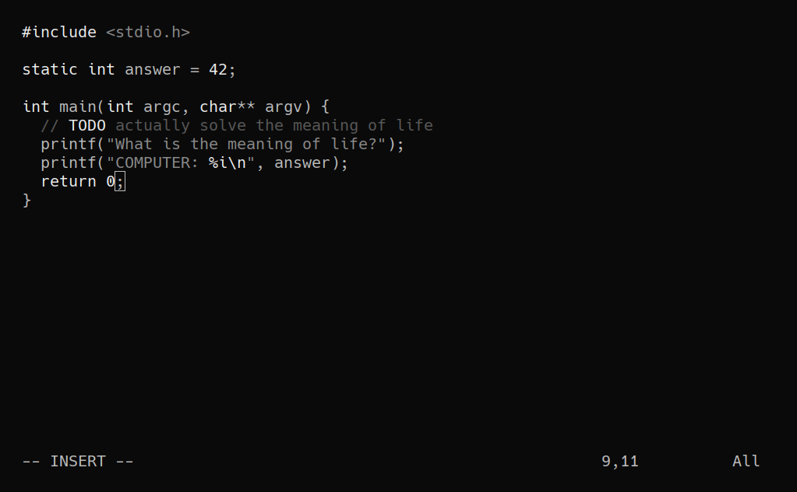

<div id="header">
    <p align="center">
      <b>simple-dark</b><br>
	  <span font-size="16px">a simple dark grayscale theme</span><br>
      <span font-size="12px">Made by <a href="http://tek256.com">Devon</a> with love.</span><br>
      <span><a href="https://discordapp.com/invite/63GvpMh">Discord</a> | <a href="https://github.com/sponsors/tek256">Sponsor</a></span>
    </p>
</div>


### About  
Simple Dark is a colorscheme aimed at being easy to read and focus with. The goal is to write with as few distractions as possible!

### Installation
For vim you can do the following:  
If you're using something like vim plug you can simply add 
```
Plugin 'tek256/simple-dark'
```
and run `:PlugInstall` to make sure the scheme is downloaded.

otherwise you can just copy the `colors` folder to your vim colors folder (usually `~/.vim/colors/`).

Once you have the scheme just adding either of the variants as colorscheme looks like
```
colorscheme simple-dark
```
or 
```
colorscheme simple-dark-transparent
```


For kitty, xfce4-terminal, or rxvt-unicode (urxvt), copy the contents of the respective files into your own config files. The config files in this repository only set colors, and do not assume any other non-apperance configurations.
